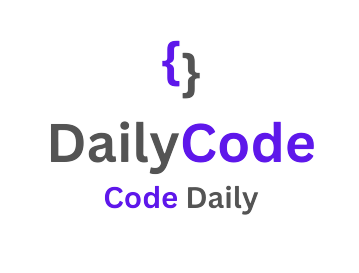

# DailyCode Extension

DailyCode is a Visual Studio Code extension designed to help you track and maintain a coding streak, motivating you to code every day. It provides a streak counter in the status bar and offers intuitive commands for streak management, making it a fun and productive addition to your coding workflow.

---

## Features

### 🔥 Coding Streak Tracker
- **Visual Streak Counter**: Displays your current coding streak in the VS Code status bar.
- **Automatic Updates**: Tracks your streak based on daily usage.
- **Missed Days**: Resets the streak automatically if no activity is detected for a day.
- **Consecutive Days**: Increments your streak for consecutive coding days.
- **Minimum Code Changes**: Allows users to set a minimum number of code changes required to qualify for a coding day.

### 🛠️ Commands
- **Show Coding Streak (`dailycode.showCodingStreak`)**: Displays your current streak in a popup notification.
- **Reset Streak (`dailycode.resetStreak`)**: Allows you to manually reset your streak.
- **Set Minimum Code Changes (`dailycode.setMinCodeChanges`)**: Lets you define the minimum number of code changes required to mark a day as active.

### 💾 Persistent Streak Data
- **Global State Storage**: Your streak count, last access date, and minimum code changes are securely saved, persisting across sessions.

### ⚡ Status Bar Integration
- **Flame Icon**: Represents your streak count visually with an accompanying tooltip.
- **Tooltip Information**: Hover to see detailed information about your streak.

### 🔗 Seamless Workflow
- **Smart Streak Management**: Automatically detects consecutive or missed days.
- **Feedback Alerts**: Provides feedback notifications when your streak updates or resets.

---

## Requirements

No external dependencies are required. DailyCode works out of the box with Visual Studio Code.

---

## Installation

1. **Install from the Marketplace**:
   - Open the [Visual Studio Code Marketplace](https://marketplace.visualstudio.com/) and search for "DailyCode."
   - Click "Install" to add the extension to your VS Code.

---

## Usage

1. **Activating DailyCode**:
   - Start coding in Visual Studio Code, and the streak counter will automatically initialize in the status bar.

2. **Accessing DailyCode Commands**:
   - Press `Ctrl + Shift + P` (or `Cmd + Shift + P` on macOS) to open the Command Palette.
   - Search for "DailyCode" to view all available commands:
     - **Show Coding Streak**: Displays your current streak in a popup notification.
     - **Reset Coding Streak**: Resets your streak to 1 manually (not recommended unless needed).
     - **Set Minimum Code Changes**: Allows you to specify the minimum number of code changes to count as an active day.

3. **Tooltip Information**:
   - Hover over the status bar item to see a tooltip with details about your current streak.

4. **Automatic Streak Updates**:
   - DailyCode automatically tracks your coding activity and updates your streak.
---

## Extension Settings

Currently, DailyCode does not include customizable settings beyond commands. Future updates may allow:
- Custom notifications for milestone streaks.
- Setting streak goals.
- Changing the reset behavior or streak counting logic.

---

## Known Issues

- No known issues at this time.

---

## Contributing

We welcome contributions from the community! To contribute:

1. Fork the repository.
2. Create a feature branch: `git checkout -b feature-name`.
3. Commit your changes: `git commit -m 'Add feature-name'`.
4. Push to the branch: `git push origin feature-name`.
5. Open a pull request on GitHub.

Please ensure all tests pass before submitting your PR.

---

## Testing

DailyCode includes automated tests for reliable performance:

1. Install development dependencies: `npm install`.
2. Run tests using `npm test`.
3. Validate edge cases and ensure full coverage.

---

## Release Notes

### 1.1.1
- **New Feature**: Added `dailycode.setMinCodeChanges` command for setting minimum code changes required for an active coding day.
- **Enhanced Feedback**: Improved feedback for consecutive streaks and streak resets.

### 1.1.0
- **Improved Testing**: Enhanced test coverage and bug fixes for streak tracking.

### 1.0.0
- **Initial Release**: Fully functional streak tracking, reset functionality, and persistent storage.

---

## Feedback and Support

If you encounter any issues or have feature suggestions:
- Submit an issue on the [GitHub repository](https://github.com/Siphosakhe2583003/dailycode).
- Reach out via email at [siphosakhemkhwanazi.github@gmail.com](mailto:siphosakhemkhwanazi.github@gmail.com).

---

## Screenshots

### Status Bar

---

## Roadmap

- **Milestone Notifications**: Celebrate streak milestones like 10, 50, or 100 days.
- **Customizable Themes**: Allow users to customize the status bar appearance.
- **Enhanced Analytics**: Provide weekly or monthly coding activity reports.
- **Calendar Feature**: A heatmap-style calendar that visually represents coding activity, highlighting the intensity of coding on specific days.

---

**Thank you for using DailyCode! Keep coding and stay motivated! 🚀**